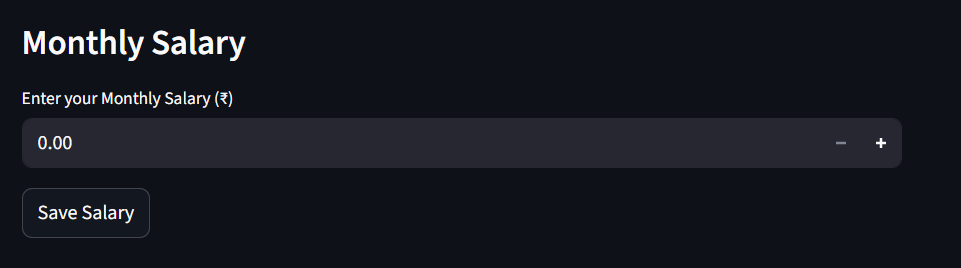
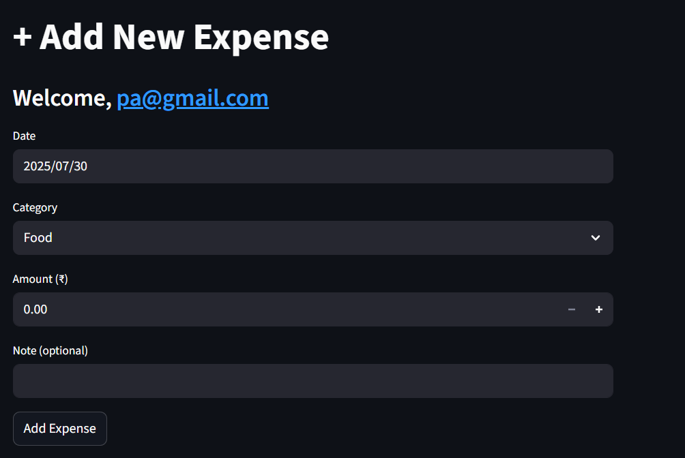
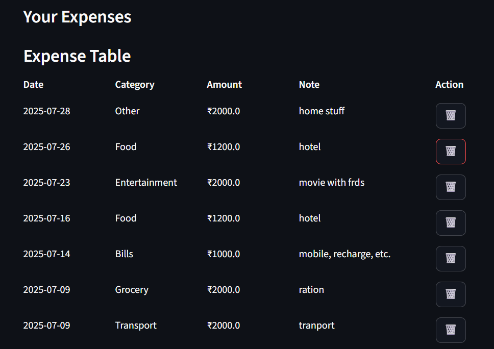
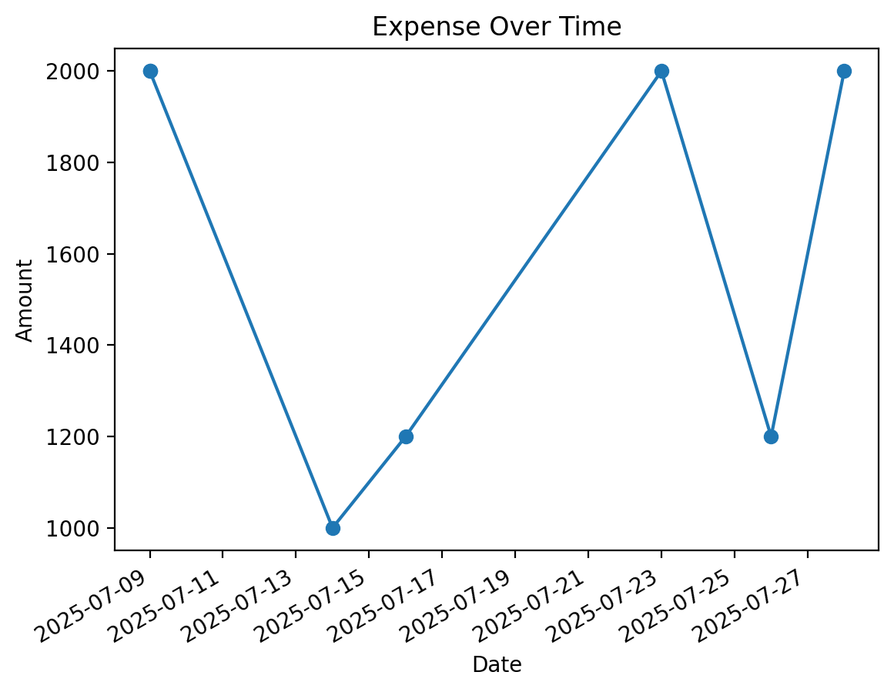
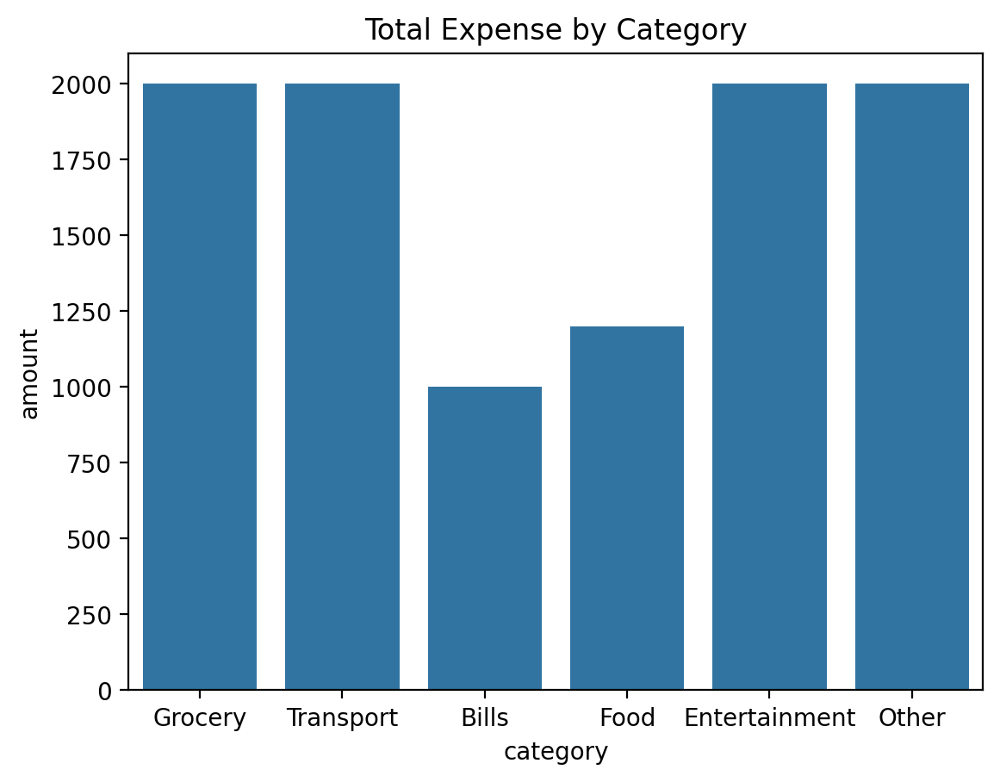
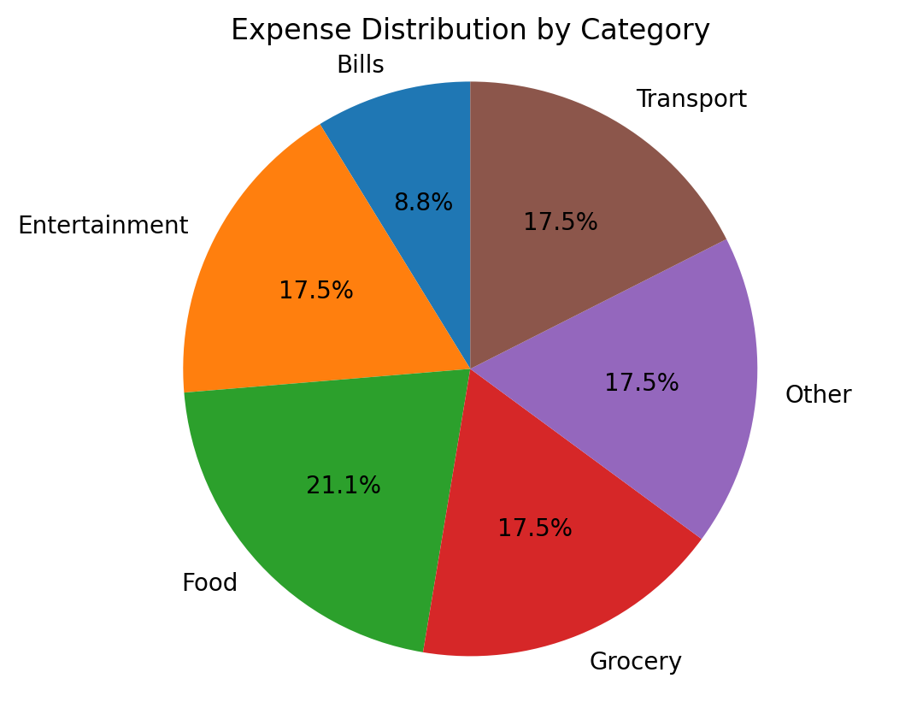

# 💸 Monthly Expense Tracker (with Firebase & Streamlit)

A secure, user-authenticated monthly expense tracker app built using **Streamlit** and **Firebase**. Users can add expenses, view reports, visualize charts, and export data — all in a simple web interface.

---

## 🚀 Features

- 🔐 User Login & Signup (Firebase Authentication)
- 📊 Add and manage monthly expenses
- 💰 Track your monthly salary and see remaining savings
- 📈 Visualize expenses with:
  - Line chart (Expense over time)
  - Bar chart (Expenses by category)
  - Pie chart (Expense distribution)
- 🧾 Export data as CSV or PDF
- 🍪 Session Management with encrypted cookies
- 🗑️ Delete specific expense entries
- 🔐 Admin-protected database via Firebase

---

## 🛠️ Tech Stack

- **Frontend/UI**: Streamlit
- **Backend/Database**: Firebase Firestore
- **Authentication**: Firebase Auth (Email & Password)
- **Charts**: Matplotlib, Seaborn
- **PDF Export**: FPDF
- **Session Handling**: streamlit-cookies-manager

---
## ✏️ Figs

---

### 🔹 Add Salary Form  



---

### 🔹 Add Expense Form  


---

### 🔹 Expense Table


---

###  Analysis 📈📉📊

---

### 🔹 Line Chart 📈📉


---

### 🔹 Bar Chart 📊


---

### 🔹 Pie chart 🟣🟢🟡🟠⭕



## 🔧 Setup Instructions

### 1. Clone the repository

```bash
git clone https://github.com/itsParas000/monthly-expense-tracker.git
cd monthly-expense-tracker
